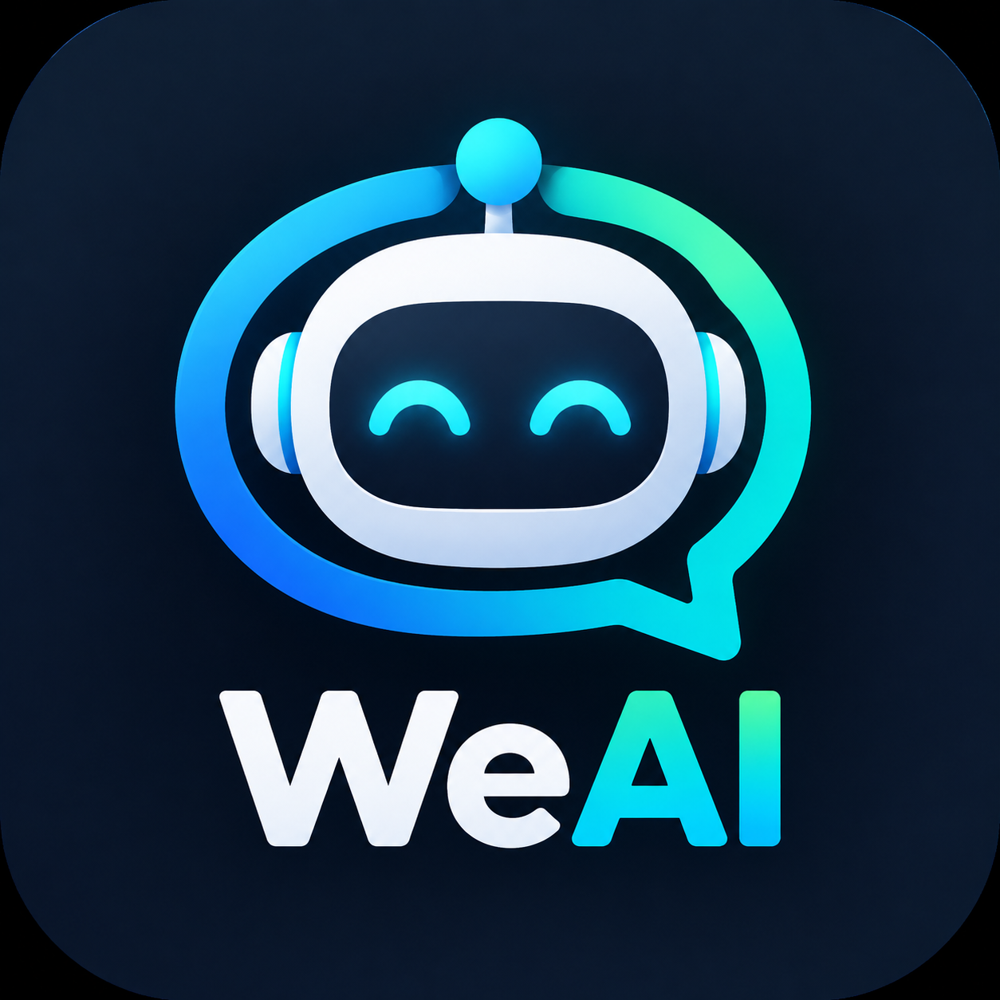

# WeAI

让微信里的交流，有人设，也有记忆。

**微信 AI 回复 · 多人设场景 · 本地记忆 · 图片与语音**

**[下载安装](https://github.com/eifelsir/WeAI/releases) · [功能概览](#功能概览) · [开始使用](#开始使用) · [常见问题](#常见问题) · [反馈问题](https://github.com/eifelsir/WeAI/issues)**

---

**WeAI 是一个在微信中运行的 AI 聊天模块。** 你可以为家人、朋友和工作群配置不同的人设，让回复结合对话现场与相关记忆，而不是每次都从零开始。

> [!IMPORTANT]
> **WeAI 模块免费，项目闭源。** 本仓库用于项目介绍、安装包发布和问题反馈，不公开应用源代码。模型、搜索等第三方服务需要自行配置，相关费用由服务商收取。

> [!NOTE]
> 当前仍在持续迭代。群聊语境判断、图片、语音、分身入口等效果受微信版本、设备环境和服务商能力影响。预发布包通过本地检查，不等于所有真机环境均已验收。

## 功能概览

| 分类 | 功能 |
| --- | --- |
| 微信内设置 | 从微信设置进入 WeAI，管理回复开关、参与对象和运行状态 |
| 回复范围 | 群聊与私聊允许名单；未授权会话不自动回复 |
| 群聊参与 | 明确提问、连续对话与 Auto 插话分别处理，支持参与节奏调整 |
| 人设与场景 | 多个人设分别绑定群或联系人；未绑定会话使用默认人设 |
| 发言限制 | 每个人设单独开关；关闭后不再附加插件的发言尺度约束 |
| 提示词保护 | 对话不能改写插件或用户配置提示词；仍按既有人设自然回复 |
| 本地记忆 | 手动事实、自动学习、称呼、置顶和雷区；按账号、会话与成员限定使用 |
| 图片理解 | 在授权的触发流程中获取图片并理解，不要求手动点开图片 |
| 语音理解 | 使用微信原生转文字，成功后参与对话；不是语音合成或声音克隆 |
| 联网查证 | 配置 REST 或 MCP 搜索，结合检索资料回答相关外部事实问题 |
| 分享内容 | 文章、视频号、文件、小程序、音乐、位置、名片与转发记录的可读信息；不把卡片内容当成本人经历 |
| 失败重试 | 临时故障有上限重试，遵守等待时间与总时限；取消、认证错误和发送失败不盲目重试 |
| 真实多条消息 | 多段回复可拆成多条微信消息，保留顺序与间隔 |
| 备份与恢复 | 导出人设和记忆，用于同一微信账号换机恢复；不包含 API 密钥 |
| 运行诊断 | 导出阶段、耗时、匿名关联与结果，用于定位触发、服务调用和发送问题 |

## 开始使用

运行环境：**Android 10 及以上，以及支持现代 API 101 的 LSPosed 兼容框架。WX版本8.0.76，其它版本自测**。普通安装 APK 不会自行获得WX内运行能力。

1. 从本仓库的 **Releases** 下载 APK，核对对应的 SHA-256。
2. 安装后，在框架管理器中启用 WeAI，作用域选择微信。
3. 彻底结束微信后重新打开，从微信设置的插件分类进入 **WeAI**。
4. 在“模型连接”填写服务商提供的 HTTPS 地址、密钥与模型，测试后保存。
5. 在“回复对象”选择允许的群或联系人。私聊需要另外开启私聊回复。
6. 配置人设，回首页开启回复总开关。需要普通群聊插话时，再开启“群里插话”并选择参与范围。

首次使用建议先选一个知情的小范围测试会话。更新时覆盖安装并重启微信，**不要为了升级卸载或清空数据**；重要人设和记忆请先备份。

<strong>人设应该怎样分配？</strong>

可以为工作群、朋友群和家人分别创建人设，再绑定相应会话。没有绑定的会话使用默认人设。绑定人设并不等于授权回复，仍需加入允许名单。

共用记忆不会自动向所有群公开全部事实；会话、成员和“仅私聊”等范围仍然有效。切换为独立记忆是切换存储范围，不会删除原来的共用库。

每个人设都有“发言限制”开关，默认开启。关闭后移除插件额外添加的粗口、黄腔、调侃和收敛语气等尺度约束，按你写的人设与当前对话表达。不会删除记忆，也不改变手动雷区或数据授权。第三方模型服务自身的规则不由模块控制。

<strong>图片、语音和分享有哪些限制？</strong>

图片需要模型支持图片输入，且模块实际取得可用图像。语音依赖微信原生转写及其宿主适配、网络和语言支持。视频号分享目前不等于视频画面与音轨理解。无法读取的资料不会被当作已读取。

1.0.1 增加文件、小程序、音乐、位置和名片的卡片信息，不读取文件正文、不运行小程序、不收听音乐；位置和名片不等于发送者本人资料。原始视频、动态表情包画面，以及语音／表情包发送暂未开放。

## 数据与隐私

- 人设、记忆与 API 配置存储于设备本地，不上传到作者服务器。
- 生成回复时，所需的聊天文字、相关记忆或图片会发送至你配置的模型服务。
- 联网搜索会向所选服务发送搜索词；读取文章会访问文章来源。
- 自动语音使用微信原生转文字服务，相关数据由该服务按其规则处理。
- 运行诊断不记录聊天正文或 API 密钥，只保留预定义事件、耗时和匿名关联等元数据。
- 备份包含记忆原文，请自行安全保管，不要上传到公开 Issue 或仓库。

启用前请取得相关聊天参与者的知情同意，并了解所配置服务的隐私政策。避免在人设或记忆中填写不必要的敏感信息。

## 常见问题

<strong>为什么没有桌面入口？</strong>

日常设置入口在微信设置内。模块保留框架所需的组件，不通过桌面启动来实现微信自动回复。

<strong>有消息记录，为什么没有回复？</strong>

收到消息不等于应当回复。允许名单、回复总开关、模型配置、明确对话对象以及 Auto 的参与节奏都会影响处理。模型也可能判断这轮不适合插话。

先检查首页状态，再导出运行诊断。新日志会注明重复消息、会话未允许、规则未满足、旧任务被替代等原因。旧日志本身没有记录的原因无法事后恢复。

“回复取消”可能是新消息替代旧任务、配置变化、暂停、撤回或发送许可失效，不等于模型故障；取消后不会强行重试旧内容。临时模型故障在预算允许时重试一次。

<strong>MCP 是否支持搜索以外的工具？</strong>

本插件当前只实现受限的搜索和网页读取，不是通用 MCP 工具执行器。接入其他只读查询需适配其参数、返回结构及权限；日历、业务系统、知识库等不会仅凭填入地址就自动可用。发送、修改或删除数据等操作也未开放。

<strong>十五分钟连续对话是否每条必回？</strong>

不是。连续对话允许自然接续，不需要每条都带固定触发词；但明确对别人说的话、不适合接话的场景仍可不回复。群聊中没有明确收话人的“你”依然需要结合上下文判断，不能保证每次推断正确。

<strong>显示联网成功，是否代表答案正确？</strong>

不代表。联网成功只说明取得了检索结果；资料可能不完整、过期或不相关，模型也可能理解错误。重要结论请自行核实，不能把自动回复当作事实保证。

<strong>为什么诊断耗时比模型后台长？</strong>

一轮回复可能包含图片处理、资料准备、联网判断、搜索、最终生成或有上限的重试。整轮耗时与服务商单次生成耗时不是同一指标。新版本分别记录阶段耗时与单次模型调用，便于定位。

## 反馈与支持

通过 [Issues](https://github.com/eifelsir/WeAI/issues) 或邮箱 [luyhsir@gmail.com](mailto:luyhsir@gmail.com) 反馈。

请提供模块版本、Android 与微信版本、发生时间、预期与实际现象，以及相应诊断日志。分身无入口时可另附该空间的 LSPosed 日志。**先遮挡个人信息，不要提交密钥、备份或完整私密聊天记录。**

模块不设付费解锁。第三方组件及其许可见 [THIRD_PARTY_NOTICES.md](THIRD_PARTY_NOTICES.md)。

发布群组TG：https://t.me/WeAIChatBot

如果WeAI对你有用，不妨赏我个鸡腿🍗：https://catfk.com/shop/7T6HBAJH/etya81

---

**不同场景，不同表达；记得彼此，也尊重边界。**

WeAI · 微信 AI 聊天模块

